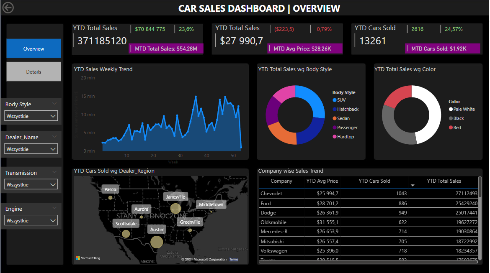
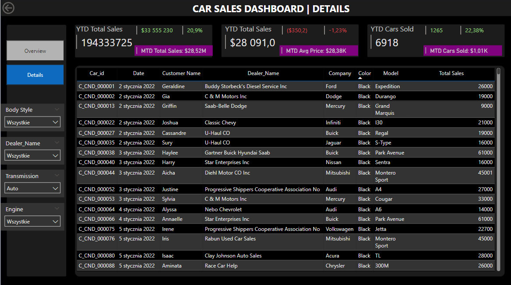

# Car_sales_dashboard
## Problem Statement
This dashboard helps the car dealership company to effectively track and analyse their sales performance. It provides real-time insights into key performance indicators related to the sales data.
## Presented data
1. Sales Overview:
- Year-to-Date (YTD) Total Sales
- Month-to-Date (MTD) Total Sales
- Year-over-Year (YOY) Growth in Total Sales
- Difference between YTD Sales and Previous Year-to-Date (PTYD) Sales
2. Average Price Analysis:
- YTD Average Price
- MTD Average Price
- YOY Growth in Average Price
- Difference between YTD Average Price and PTYD Average Price
3. Cars Sold Metrics:
- YTD Cars Sold
- MTD Cars Sold
- YOY Growth in Cars Sold
- Difference between YTD Cars Sold and PTYD Cars Sold
## Overview Dashboard Screenshot

## Charts description
1. YTD Sales Weekly Trend - a line chart illustrating the weekly trend of YTD sales
2. YTD Total Sales by Body Style - the distribution of YTD total sales across different car body styles using a pie chart
3. YTD Total Sales by Color - the contribution of various car colors to the YTD total sales using a pie chart
4. YTD Cars Sold by Dealer Region - showcase the YTD sales data based on different dealer region using a map chart to visualize the sales distribution geographically
## Details Dashboard Screenshot

## Details Dashboard Description
Detailed grid that presents all relevant information for each car sale, including car model, body style, sales amount, dealer region, date etc.
